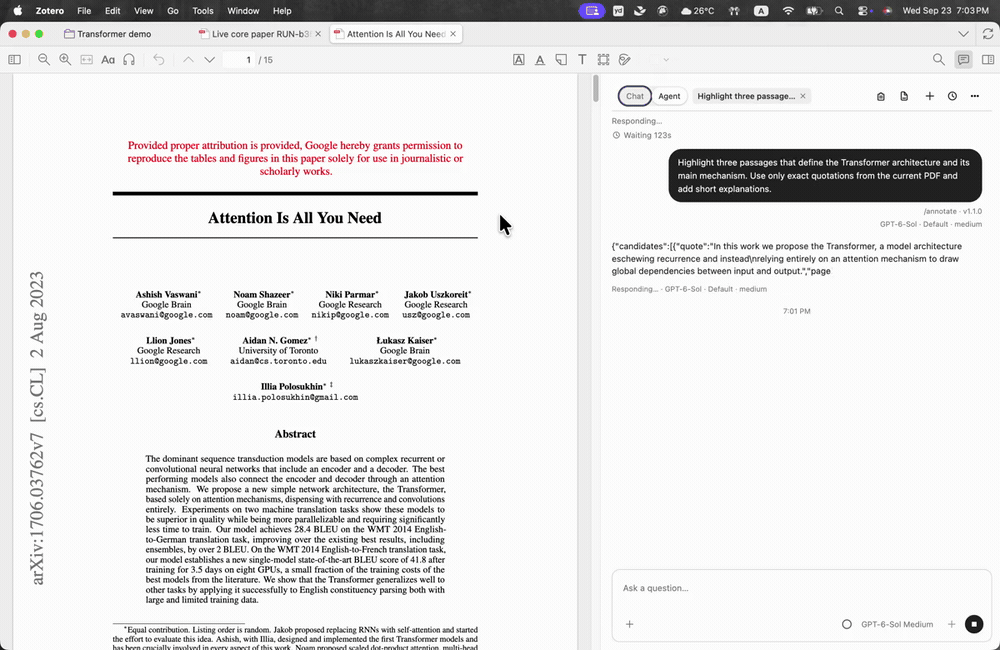

# zotero-chatgpt

**Read papers. Stay in Zotero.**

ChatGPT for your papers. An Agent for your library.


## Ask your paper

Explain a passage, unpack a derivation, or ask a follow-up—right beside your PDF. Chat uses the official ChatGPT website. It includes the current paper's title, authors, publication, DOI, and stored abstract by default; a passage you select is added separately. Turn automatic paper details off in the plugin settings.

> “What is the key idea behind this method?”


*Bring a passage into your question. Shown before sending.* [View still image](docs/media/chat-demo-poster.png)

## Put Agent to work

Highlight key passages and explain a Figure with native callouts. In Zotero's main library window, open **Zotero Agent** to ask for papers on a topic, organize selected or `@` mentioned articles, fill blank DOI-backed metadata, create a short abstract-based note, or create a collection. The workbench has a conversation, `/` skills, `@` Zotero references, and a review card for each write. You can switch the same main-window panel to official ChatGPT for one selected article.

Agent highlights apply automatically only after the quoted passages are verified against the PDF. Figure callouts and library writes require review, with native readback and conflict-aware undo. Topic search uses OpenAlex for discovery; a paper is only reported as downloaded when Zotero verifies its OA PDF attachment.

> “Highlight the five most important passages and explain why.”

In a dedicated Zotero test library, GPT-6 Sol highlighted three verified passages in *Attention Is All You Need* and Zotero saved all three native annotations automatically.



Figure callouts, collection creation, metadata fill, and notes have local and native test coverage; their complete model-to-approval flows still need separate live verification.

Agent is experimental; fetching open-access PDFs from a DOI or article link is still being refined.

## Get started

Install the `.xpi` in Zotero. Open a PDF and its sidebar for Chat, highlights or Figure explanations. Use **Zotero Agent** in the main library window for topic discovery and library work; no PDF needs to be open. Sign in to Codex when you use a model-backed Agent task.

**Chat needs no API key and uses no Codex quota.**
Agent uses Codex quota and requires separate sign-in.

The Agent model picker shows GPT-6 Sol, Astra, and Luna when the active Codex runtime reports them, with Sol preferred for new work.

On Linux x86_64, the Agent uses the installed Codex CLI. Set `CODEX_CLI_PATH` when it is not in
`~/.local/bin/codex` or `PATH`; the existing `~/.codex/auth.json` login is copied into the plugin's
private runtime account. Build this fork with Node 24, then install `build/zotero-chatgpt.xpi`:

```sh
cd ~/src/zotero-chatgpt
npm ci
npm run package:dev
```

_Early preview · macOS (Apple Silicon) and Linux x86_64 · Zotero 9.0.6._

---

Independent community project. Not affiliated with or endorsed by Zotero or OpenAI.
