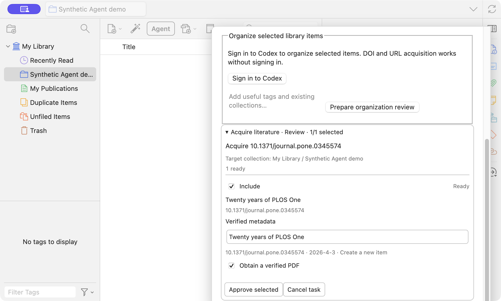

# zotero-chatgpt

**Read papers. Stay in Zotero.**

ChatGPT for your papers. An Agent for your library.


## Ask your paper

Explain a passage, unpack a derivation, or ask a follow-up—right beside your PDF. Chat uses the official ChatGPT website. It includes the current paper's title, authors, publication, DOI, and stored abstract by default; a passage you select is added separately. Turn automatic paper details off in the plugin settings.

> “What is the key idea behind this method?”


*Bring a passage into your question. Shown before sending.* [View still image](docs/media/chat-demo-poster.png)

## Put Agent to work

Highlight key passages. Organize selected papers with tags and collections. From Zotero's library window, open **Zotero Agent** to add a paper from a DOI or public article URL without opening a PDF first. Preview and approve changes before they reach your library.

> “Highlight the five most important passages and explain why.”



*Agent acquisition demo in a dedicated Zotero test library: [open from My Library](docs/media/agent-library-entry.png) → review the verified metadata → [see the saved result](docs/media/agent-acquisition-result.png). The PLOS article gained a verified PDF; a second DOI saved metadata and accurately reported that no OA PDF was available. No Codex model turn was used for this DOI workflow.*


*Illustrated highlighting workflow; the live model highlight demo is still pending verification.*

Agent is experimental; fetching open-access PDFs from a DOI or article link is still being refined.

## Get started

Install the `.xpi` in Zotero. Open a PDF and its sidebar for Chat or paper highlights; use **Zotero Agent** in the main library window for article acquisition and selected-item organization. Sign in to Codex when you use a model-backed Agent task.

**Chat needs no API key and uses no Codex quota.**
Agent uses Codex quota and requires separate sign-in.

The Agent model picker shows GPT-6 Sol, Astra, and Luna when the active Codex runtime reports them, with Sol preferred for new work.

On Linux x86_64, the Agent uses the installed Codex CLI. Set `CODEX_CLI_PATH` when it is not in
`~/.local/bin/codex` or `PATH`; the existing `~/.codex/auth.json` login is copied into the plugin's
private runtime account. Build this fork with Node 24, then install `build/zotero-chatgpt.xpi`:

```sh
cd ~/src/zotero-chatgpt
npm ci
npm run package:dev
```

_Early preview · macOS (Apple Silicon) and Linux x86_64 · Zotero 9.0.6._

---

Independent community project. Not affiliated with or endorsed by Zotero or OpenAI.
