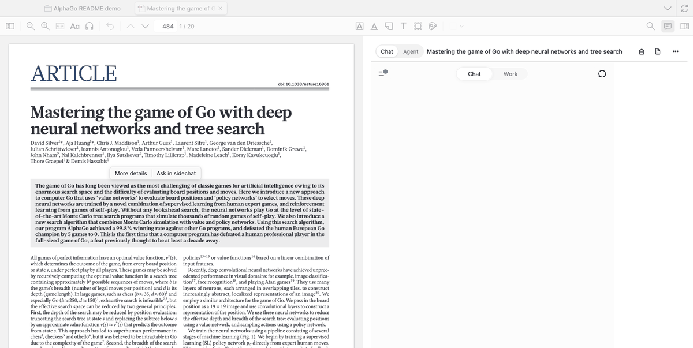
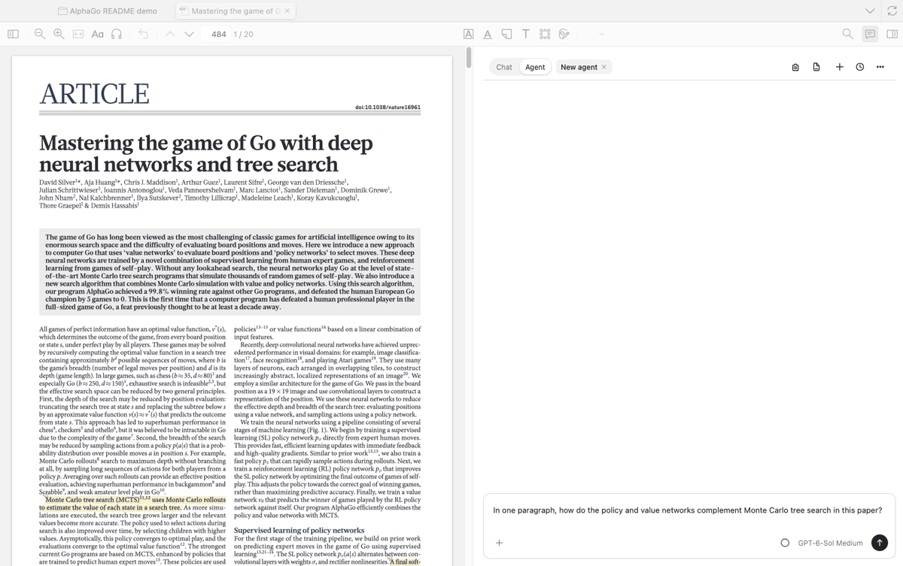
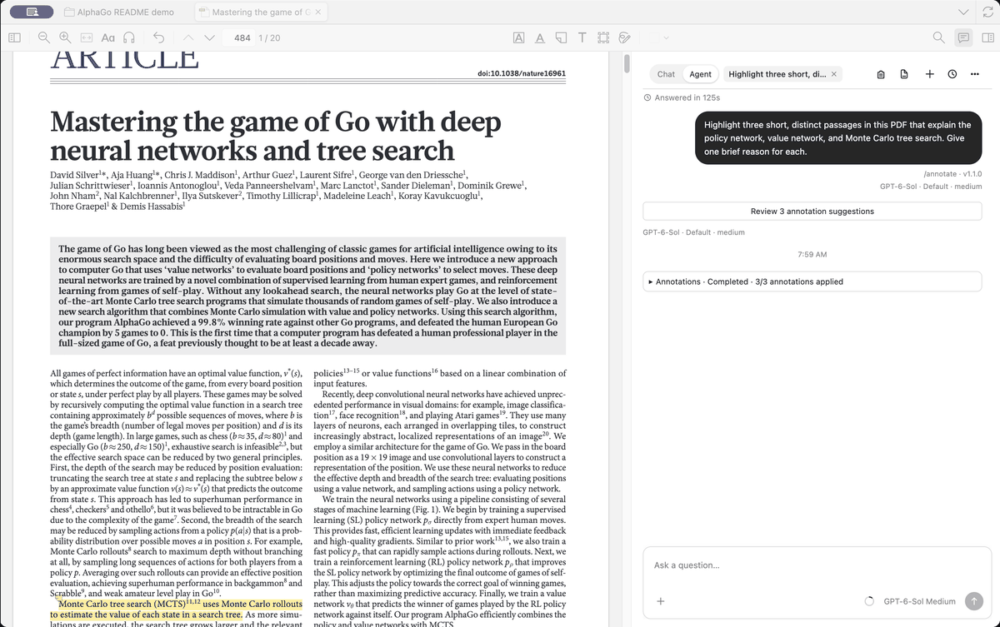
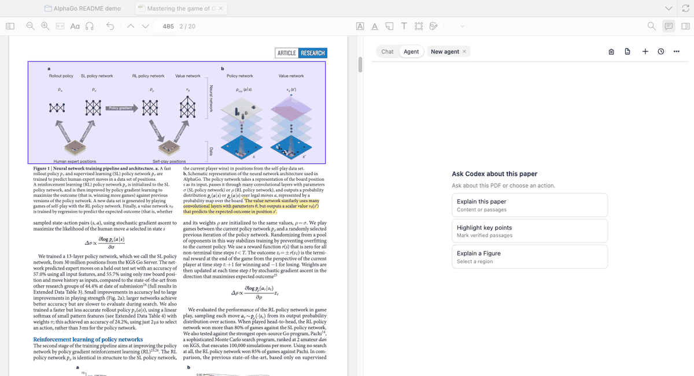
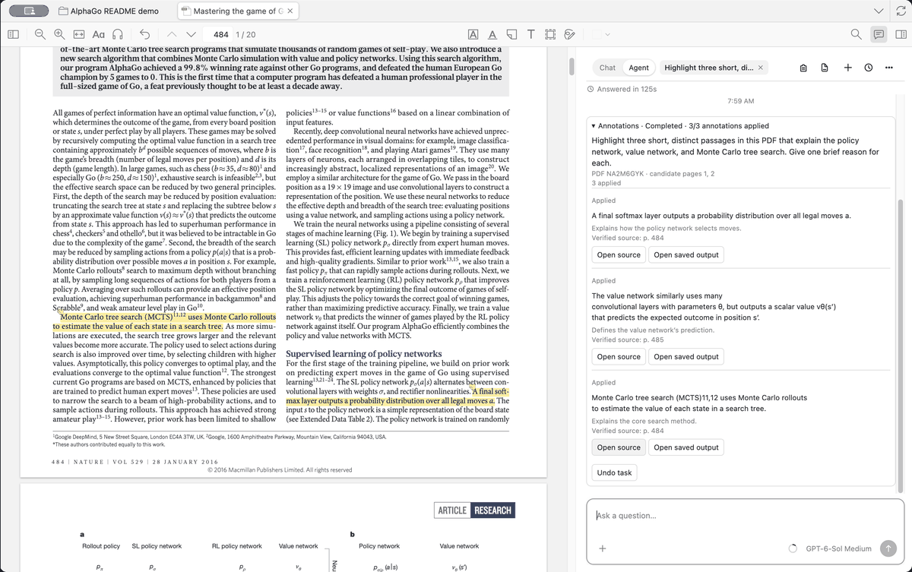

# Zotero ChatGPT

[English](README.md) · [下载 v0.1.1](https://github.com/kianmax0/zotero-chatgpt/releases/tag/v0.1.1)

**在 Zotero 里用 ChatGPT 读论文，用 Codex Agent 完成受控操作。**

| 模式 | 用途 |
| --- | --- |
| **Chat** | 在 ChatGPT 官网页面里就当前论文提问。插件会准备好书目信息与已保存摘要，你也可以额外加入选中的原文。不需要 API key，不使用 Codex 额度，也不需要单独登录。 |
| **Agent** | 由 Codex 解释论文、写入经验证的原生高亮，或提出 Figure 圈画候选。在文献库窗口可按主题发现文章、获取开放获取 PDF、整理选中的条目。需要单独登录，使用 Codex 额度。 |

默认进入 Chat，且 Chat 不发起任何 Codex 请求。Agent 的写入只作用于本次指定的论文或集合：明确要求且验证通过的高亮自动写入，其余改动先预览并等待批准。Figure 与依赖模型的文献库链路在当前 `main` 上仍属实验功能，见[进度记录](docs/progress.md)。

## 演示

Silver 等人（2016）的 *[Mastering the game of Go with deep neural networks and tree search](https://doi.org/10.1038/nature16961)*，在隔离的文献库中操作。每个 GIF 都是当前 `main` 版本真实窗口截图的剪辑，不是连续录屏。

**Chat——就选中的原文提问。** 选中原文后点击 **More details**，在 ChatGPT 官网页面获得回答。



**Agent——就论文提问。** 独立的 Codex 会话回答问题并给出页码。



**Agent——高亮关键段落。** Agent 先验证原文，再写入三条 Zotero 原生高亮。



**Agent——圈画 Figure 1。** 审核候选圈画，然后批准原生图像区域与 ink 标注。



**Agent——定位结果。** 用任务输出控件在 PDF 中打开保存的高亮。



## 安装

从 [v0.1.1 Release](https://github.com/kianmax0/zotero-chatgpt/releases/tag/v0.1.1) 下载 `.xpi`，拖入 **工具 → 插件** 窗口。要求 Zotero 9.0.6。macOS Apple Silicon 上 Agent 使用随包运行时；Linux x86_64 上需要已安装的 Codex CLI。

若要在 macOS Apple Silicon 上构建当前 `main` 版本（Node 24、npm 11）：

```sh
git clone https://github.com/kianmax0/zotero-chatgpt.git
cd zotero-chatgpt
npm ci
node scripts/runtime-prepare.mjs
npm run package:dev
```

用同样方式安装 `dist/zotero-chatgpt-0.1.1-dev.xpi`；它与 v0.1.1 版本号相同，但内容更新。

## 开始使用

1. 打开 PDF，点击阅读器里的对话气泡。默认进入 Chat，在官方页面中登录 ChatGPT 后提问。
2. 就论文提问，或选中段落后点 **Ask in sidechat** 暂存问题。你提交之前不会发送任何内容。
3. 需要 Codex 任务时才切到 **Agent**。主题发现、获取与整理在文献库主窗口中操作。

设置中可关闭自动文献信息。复制 PDF 只是为你准备好粘贴内容，不会自动上传。

---

独立社区项目，与 Zotero、OpenAI 无隶属或背书关系。
