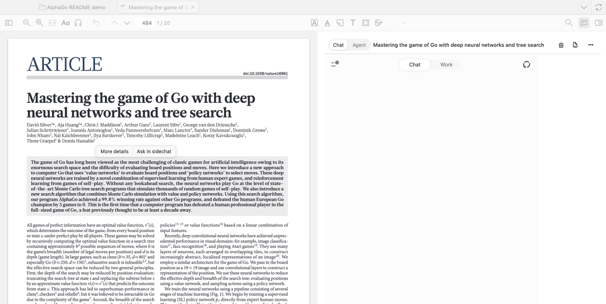
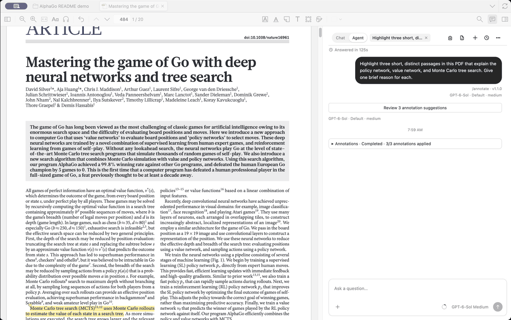
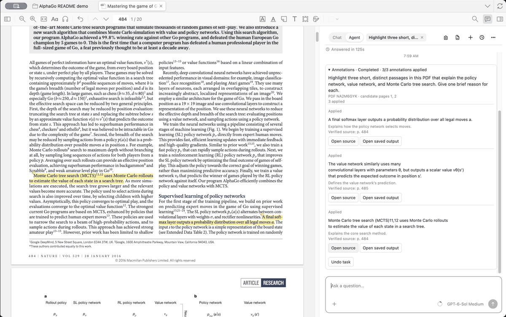

# zotero-chatgpt：Chat 只管读论文，额度留给 Agent 动手

> 历史营销草稿，使用较早开发包的演示素材。当前开发包的官网输入框兼容性仍受阻；实际可用性以 [进度记录](../../progress.md) 为准。本稿未作为本轮产品验收或新版发行说明。

在 Zotero 里用 AI 读文献，主流是两条路：填 API key 让插件替你调模型，或者让插件驱动网页替你敲问题。前者多一份账单，后者说不清背后干了什么。

zotero-chatgpt 走的是第三种：把 AI 拆成两个模式，一个只对话，一个能动手。

| | Chat | Agent |
| --- | --- | --- |
| 背后是什么 | chatgpt.com 官网页面 + 你的 ChatGPT 订阅 | Codex |
| 占不占 Codex 额度 | 不碰 | 占 |
| 能不能动你的文献库 | 不能，只读 | 能 |

默认进 Chat。只有主动切到 Agent，才会去连 Codex。

## 一、Chat 为什么是官网页面，不是 API

**钱。** API 另外计费。很多人在 Zotero 里只是偶尔问两句，为此多一份账单不值当。官网页面用的是你本来就付过的那份订阅，也不占 Codex 额度。

**账号。** 接 API，插件就得碰你的 key。走官网页面，插件不碰任何密钥，你就在那个页面里正常登录。

**插件不该假装自己是模型。** 你看到的回答是官方页面给你的，不是插件拼的。插件只做两件事：准备上下文、把选区递过去，然后让开。

用法：侧栏打开官网页面，选中原文点 More details，问题送进页面，回答也在页面里。插件会先准备好这篇文献的书目信息和已保存的摘要。

它能读的东西你很清楚地知道：书目、摘要、你手动选中的原文，就这些。不会把整个 PDF 偷偷传上去——插件只在本地读 PDF 文本，外发什么由你这次显式选择决定，自动带文献信息也可以关掉。工具栏里那个"复制 PDF"只是把内容准备好给你粘贴，复制不是上传。

## 二、Agent 能动手，所以每步都要能验证、能撤销

能调工具，就意味着它写下的东西会留在你的库里。原生高亮是最典型的例子：

1. 模型不给坐标，只给原文 quote、页码提示和理由。
2. 程序拿 quote 去当前冻结的 PDF 里做**全篇唯一匹配**，命中唯一才验证原生几何。
3. 不存在、不唯一、超出可靠范围——直接不写。
4. 只有你这次明确发了高亮请求，验证通过的候选才自动写入，不再让你点第二次。
5. 写入后从 Zotero 原生接口读回，进任务账本；撤销只动能证明属于本次任务、且与写后快照一致的改动。

一句话：**模型可以胡说，但胡说落不到你的库里。** 它没有坐标决定权，也没有"这里大概有这句话"的空间。

写出来的高亮就是 Zotero 原生高亮，不是自绘的方块。注释里只有 `[AI · Zotero ChatGPT]` 标识和一句简短理由。

## 三、两个模式是隔开的

这决定了上面那笔额度账能不能站住。

Chat 永远不会拉起 Codex。不是"你没点所以没发"，是进程都不存在。测试里这条单独跑：只用 Chat 的冷启动，断言插件侧 Codex 进程数为 0，也不触发运行时准备。

Chat 失败也不会静默换成 API、不换 provider、不给你编个回答再说原来那条成功了。长 PDF、问题复杂、Agent 已登录，都不是自动升级到 Codex 的理由。模式只能自己切。

## 四、界面长得就是 Zotero 的样子

插件最容易做坏的地方是硬塞一套自己的界面。这里的选择是反过来：能沿用宿主的就沿用。

顶部只占一行——模式开关、会话标题、复制按钮、新建/历史/更多，全在这一行里。工具提示用 Zotero 原生 tooltip，键盘聚焦也一样能读。

选区菜单不另造一套：Zotero 自带复制和 `Ask in sidechat` / `More details` 照原样工作，插件只是接住结果。主窗口的入口紧邻搜索框，用的是阅读器里那个对话气泡图标，再点一下关闭，不额外加叉号。打开 PDF 时主窗口工作区自动收起。

它也不强行把两个模式塞进一个输入框。Chat 用官方自己的输入框，Agent 用原生输入框，各自保留草稿和滚动位置，切换时不自动发送、也不互相注入。

窗口方面保留 Zotero 原生条目详情栏和它的侧边按钮，分隔条可拖动、也能用方向键调。PDF 缩放、旋转和阅读锚点不受侧栏重排影响，缩放和聊天字号是两个独立设置。中文输入法组合期间按回车不会误发。流式输出刷新时不会把你正在读的旧消息顶走。

## 五、Agent 还能干什么

高亮只是 Agent 最常用的一件事。它的设计目标是能真的替你动手，除此之外还面向这些能力：

**下载文献。** 给它一个明确的 DOI 或公开文章地址，再加一个目标集合，它会先查重、把结果给你预览，你批准之后保存元数据，并尝试抓取合法的开放获取 PDF。元数据和 PDF 分开报告——元数据存下了但 PDF 没拿到，它会直接说只成功一半。

**整理文献库。** 作用于你实际选中的条目，或者用 `@` 明确指定的集合，只做加法：加标签、加进已有集合。不移动、不合并、不删除条目。一次最多 50 项，超过要缩小范围；用 `@文库` 时必须给出查询词，它不会默默遍历你整个库。

**在 PDF 里圈画。** 框选一个 Figure，模型只给出裁图范围内的归一化位置，绝对坐标由宿主按 PDF 几何验证，然后写入原生图像区域和 ink 标注。模型说在哪不算数，验证过了才算。

它还能补元数据、生成子笔记、新建集合——每一样都有自己的候选、批准和撤销规则，并且会从 Zotero 原生接口读回结果。模型也可以自己挑，默认 Sol，可以换成 Astra 或 Luna，instructions 和 skills 也能配。

这些能力在仓库的进度文档里各有一份状态，没跑通的会直接标出来。

## 六、五分钟就能知道值不值

**上手不需要任何配置。** 不用配 API key，不用额外开一份订阅，也不用重新学一套界面。装完默认就在 Chat：不碰 Codex 额度，也不会动你的文献库，纯粹只读。

**回报马上能感觉到。** 打开你手上正在读的那篇论文，选中你觉得最绕的那一段，点 More details。如果它替你省掉了半小时的查证，这个插件就已经值了。要它动手做事，再切到 Agent。

**现在就能装。** 从仓库 Releases 下载 `.xpi`，拖进 Zotero 的「工具 → 插件」窗口。拿你今天本来就要读的那篇论文去试，比看任何介绍都直接。觉得好用，点个 star 就是最好的反馈。

仓库：`kianmax0/zotero-chatgpt`

独立社区项目，与 Zotero、OpenAI 无隶属或背书关系。
